# Aegis

Eclipse-DAO-administered arbitration court. A standalone arbitration
protocol that escrow systems plug into by setting their `arbiter`
address to a deployed `Aegis` contract. Built first to back Vaultra;
the `IArbitrableEscrow` interface keeps it open to any other escrow
protocol.

> Status: **v0.5 / pre-audit.** Single-arbiter + appeal-of-3 redesign,
> 31 contract specs passing (+2 fork-gated), 26 service-layer specs,
> end-to-end integration with real VaultraEscrow. In-house pre-audit
> closed 2 HIGH, 4 MEDIUM, 4 LOW; **0 actionable findings open**.
> Production deploy still requires an external audit and a live
> Chainlink VRF subscription on the target chain — see
> `docs/security-review-redesign.md` and `docs/integration-vaultra.md`.

## What it does

```mermaid
flowchart LR
    A[Worker raises dispute on Vaultra] --> B[Keeper sees DisputeRaised]
    B --> C[VaultraAdapter.registerCase]
    C --> D[Aegis.openDispute requests VRF]
    D --> E[VRF callback seats panel]
    E --> F[Panel posts briefs + commits + reveals]
    F --> G{Reveal window}
    G -- all revealed --> H[Verdict staged: AppealableResolved]
    G -- expired + quorum --> H
    G -- expired + no quorum --> I[Slash + redraw]
    I -- second stall --> J[50/50 default]
    H --> K{Appeal window}
    K -- expired no appeal --> L[Apply original verdict]
    K -- party files appeal --> M[Larger panel re-arbitrates]
    M -- within tolerance --> L
    M -- overturned --> N[Slash original panel; apply appeal verdict]
    L --> O[Adapter calls VaultraEscrow.resolveDispute]
    N --> O
    J --> O
```



What Aegis adds, on top of a bare `arbiter EOA`:

**Institutional features**
- ELCP-staked arbiter registry managed by Eclipse DAO governance, with
  `lockedStake` accounting that prevents unstake-mid-case dodge
- Chainlink VRF panel selection — verifiable randomness; original panel
  AND redraw both go through VRF
- Commit-reveal voting with a finalize gate that requires either all
  reveals or a fully-expired window (no first-quorum manipulation)
- Self-recusal, public conflict-of-interest registry, recusal-history
  audit trail per arbiter
- Two-round timeout fallback ending in a deterministic 50/50 default —
  no permanently-stuck disputes
- Bond-only slashing — non-revealers forfeit one stake bond, no
  disproportionate punishment for over-staking
- **Appeals layer** — verdict stages in `AppealableResolved` for the
  appeal window; either party can post an ELCP bond to trigger a
  larger panel re-arbitration. If the appeal verdict differs from
  the original by more than the configured tolerance, the original
  panel is slashed and the appeal verdict applies. Otherwise the bond
  pays the appeal panel and the original verdict stands.

**Privacy**
- Optional **end-to-end encrypted briefs** — hybrid AES-256-GCM +
  X25519 ECDH; deterministic keypair from a wallet signature;
  client-side encrypt + decrypt, server only sees ciphertext
- Same scheme applied to **encrypted evidence files** (PDFs,
  images, etc.) for adversarial disputes

**Transparency**
- Public dispute ledger with keyset pagination + multi-status filter
- Per-case timeline assembling every event chronologically
- Per-arbiter profile pages (stake, case history, reveal-rate,
  declared conflicts, encryption pubkey)
- `/queue` page for arbiters showing every case they're on with
  commit/reveal status

**Operations**
- `/admin` ops dashboard — keeper cursors, lag, case backlog,
  VRF-stuck detection, drill-down on failed imports + manual resolve
- Auto-finalize sweeps stalled cases on each keeper tick
- Rate-limited auth + evidence endpoints
- Idempotent indexing keyed on `(chainId, aegisAddress, caseId)`

**Plug-in**
- Any escrow contract that implements `IArbitrableEscrow` can use
  Aegis as its court (Vaultra is one such consumer)

## Layout

```
/                       Next.js 14 app (React 19, wagmi v2, viem v2)
/blockchain             Hardhat sub-project — Aegis + VaultraAdapter + tests
/blockchain/integration-fixtures   Vendored VaultraEscrow.sol for cross-repo tests
/app/cases              Public ledger + per-case workspace (briefs, evidence,
                        commit-reveal, appeal button, timeline)
/app/queue              Per-arbiter "what's on my plate" view
/app/arbiters           Roster + per-arbiter profile (stake, history,
                        conflicts, encryption pubkey)
/app/governance         Eclipse-DAO calldata builder
/app/admin              Ops dashboard + failure drill-down
/app/api                Auth, cases, briefs, evidence, arbiters,
                        keys, conflicts, queue, admin
/lib/auth               SIWE + iron-session, ported from Vaultra
/lib/crypto             X25519 + AES-GCM hybrid sealing for encrypted
                        briefs and evidence
/lib/cases              Idempotent case indexing + brief / evidence
                        access control + timeline assembly
/lib/keeper             Vaultra→Aegis bridge, Aegis event mirror,
                        auto-finalize, failure log
/lib/db                 Drizzle schema + lazy postgres client
/lib/abi                Auto-exported from Hardhat artifacts (do not edit)
/scripts                ABI export, keeper CLI
/docs                   integration-vaultra, integration-newdapps, security-review
```

## Quickstart (local hardhat)

Three terminals:

```bash
# 1. Deps
pnpm install
pnpm contracts:compile
pnpm contracts:export-abi

# 2. Hardhat node + contracts + seeded case
pnpm contracts:node              # terminal A
pnpm contracts:deploy:local      # terminal B; paste output into .env.local

# 3. Optional: Postgres + dev server
pnpm db:push                     # against your DATABASE_URL
pnpm dev                         # http://localhost:3457
```

`contracts:deploy:local` deploys a Mock ELCP + USDC, a Mock VRF
Coordinator, Aegis, and a `MockArbitrableEscrow`. Registers + stakes
3 test arbiters, opens a sample case, and drives the mock VRF
fulfillment so the panel is seated. Print env-vars are dumped to
stdout; paste them into `.env.local`.

## Deploying to Base / Base Sepolia

See `docs/integration-vaultra.md` for the full checklist. Production
deploys need a live Chainlink VRF subscription on the target chain
(not optional — `openDispute` reverts if the coordinator can't fulfil).

```bash
# 1. Aegis
cd blockchain && pnpm exec hardhat ignition deploy ignition/modules/Aegis.ts \
  --network baseSepolia \
  --parameters '{
    "Aegis": {
      "governance":         "0x<eclipse-governance>",
      "stakeToken":         "0x<elcp-token>",
      "treasury":           "0x<eclipse-treasury>",
      "vrfCoordinator":     "0x<chainlink-coordinator-on-this-chain>",
      "vrfKeyHash":         "0x<gas-lane-key-hash>",
      "vrfSubscriptionId":  "<sub-id>"
    }
  }'

# 2. VaultraAdapter
cd blockchain && pnpm exec hardhat ignition deploy ignition/modules/VaultraAdapter.ts \
  --network baseSepolia \
  --parameters '{
    "VaultraAdapter": {
      "aegis":   "0x<aegis>",
      "vaultra": "0x<vaultra>"
    }
  }'

# 3. Wire Vaultra (Vaultra owner only)
cast send <vaultra> "updateEclipseDAO(address)" <adapter>

# 4. Add the deployed Aegis as a consumer of your VRF subscription on
#    the Chainlink dashboard.

# 5. Cron the keeper
KEEPER_PRIVATE_KEY=0x... \
KEEPER_CHAIN_ID=84532 \
KEEPER_RPC_URL=https://sepolia.base.org \
pnpm keeper
```

## Tests

```bash
pnpm contracts:test          # 31 hardhat specs (+2 pending on fork RPC)
pnpm test                    # 26 vitest tests (auth, brief schema, rate-limit, crypto)
pnpm e2e                     # Playwright integration (needs `pnpm contracts:node` running)
pnpm typecheck               # cold ~30-60s on WSL2; warm ~3s
pnpm build                   # production Next.js build
```

## Plug your own escrow in

Implement `IArbitrableEscrow` (see
`blockchain/contracts/interfaces/IArbitrableEscrow.sol`):

```solidity
interface IArbitrableEscrow {
    function getDisputeContext(bytes32 caseId)
        external view
        returns (address partyA, address partyB, address feeToken, uint256 amount, bool active);

    function applyArbitration(bytes32 caseId, uint16 partyAPercentage, bytes32 rationaleDigest)
        external;
}
```

Set Aegis as your contract's arbiter and run a keeper that calls
`Aegis.openDispute(yourContract, caseId)` whenever your protocol
enters a disputed state. Full guide: `docs/integration-newdapps.md`.

## Encrypted briefs (optional, opt-in)

For adversarial disputes where parties don't want the opposing party
to read the brief / evidence until resolution. End-to-end client-side;
the server only sees ciphertext.

1. Each panelist visits their `/arbiters/[address]` profile and
   clicks "Configure encryption" — signs a fixed message
   (`Aegis encryption key v1`), the wallet's signature deterministically
   derives an X25519 keypair, the pubkey is posted to the server.
2. When uploading a brief or evidence file, parties tick "Encrypt"
   in the UI. The browser fetches recipient pubkeys, generates a
   per-brief AES-256-GCM key, encrypts the body, wraps the AES key
   to each recipient's pubkey via X25519 ECDH + HKDF-SHA256, ships
   the ciphertext + per-recipient sealed keys.
3. Recipients decrypt client-side using their wallet-derived private
   key (cached in localStorage, re-derivable on any device).

Limits: encrypted briefs / evidence are NOT versioned in v1. Panel
changes (recusal, redraw) don't auto re-encrypt — the author re-saves
to refresh recipients.

## Appeals

Once an original-panel verdict lands, status flips to
`AppealableResolved` and the case enters a configurable appeal window
(default 7 days). Either party can file an appeal by posting an ELCP
bond (default 2× stakeRequirement); a larger panel (default 5,
configurable) is selected via VRF, excluding the original panel.

If the appeal panel's median is within `appealOverturnTolerance`
percentage points of the original (default ±5pp), the original
verdict is *upheld* — bond pays the appeal panel + treasury, original
panel paid normally. Otherwise the verdict is *overturned* — original
panel each lose one stakeRequirement, bond is refunded to the
appellant, the appeal verdict applies, and the appeal panel takes the
slashed amount + the escrow fee.

Appeal-panel stall ⇒ appeal panel slashed, bond forfeited to treasury,
original verdict settles. No recursive appeals.

## Security

`docs/security-review.md` is a pre-audit walkthrough. Seven findings
addressed across v0.1–v0.4:

- **F-01 HIGH** — unstake-mid-case dodge fixed via `lockedStake`
- **F-02 LOW** — `stake()` CEI ordering tightened
- **F-03 MEDIUM** — finalize gated on all-revealed-or-window-expired
- **F-04 INFO** — recusal mechanism (partial fix for COI)
- **F-05 LOW** — slash forfeits one bond, not 50% of total stake
- **F-06 MEDIUM** — `openDispute` deduplication via `liveCaseFor`
- **F-07 MEDIUM** — Chainlink VRF panel selection

**Zero MEDIUM findings remaining.** External audit still recommended
before any mainnet deploy.

## Docs

- `docs/integration-vaultra.md` — Vaultra-specific deploy + smoke checklist
- `docs/integration-newdapps.md` — IArbitrableEscrow contract for new escrows
- `docs/security-review.md` — threat model + findings
- `CLAUDE.md` — working notes for future Claude sessions
- `CHANGELOG.md` — what landed in each release
