# Aegis

Eclipse-DAO-administered arbitration court. A standalone arbitration
protocol that escrow systems plug into by setting their `arbiter` address
to a deployed `Aegis` contract. Built first to back Vaultra; the
`IArbitrableEscrow` interface keeps it open to any other escrow protocol.

> Status: **v1 / pre-audit.** 37 contract tests + 10 service-layer tests +
> end-to-end integration with real VaultraEscrow all passing. Two MEDIUM
> security findings remain documented in `docs/security-review.md` —
> review before any meaningful-TVL deploy.

## What it does

```mermaid
flowchart LR
    A[Worker raises dispute on Vaultra] --> B[Keeper sees DisputeRaised]
    B --> C[VaultraAdapter.registerCase]
    C --> D[Aegis.openDispute draws panel]
    D --> E[Panel posts briefs + commits + reveals]
    E --> F{Reveal window}
    F -- all revealed --> G[Aegis.finalize median]
    F -- expired + quorum --> G
    F -- expired + no quorum --> H[Slash + redraw]
    H -- second stall --> I[50/50 default]
    G --> J[Adapter calls VaultraEscrow.resolveDispute]
    I --> J
    J --> K[Vaultra settles parties + pays arbiter cut to court]
    K --> L[Court splits fee 80% panel / 20% treasury]
```



Adds, on top of a bare `arbiter EOA`:
- **ELCP-staked arbiter registry** managed by Eclipse DAO governance
- **Pseudo-random panel selection** with party + locked-stake exclusion
- **Commit-reveal voting** with a finalize gate that prevents first-quorum
  manipulation
- **Self-recusal** for arbiters who realise a conflict of interest
- **Two-round timeout fallback** ending in a deterministic 50/50 default —
  no permanently-stuck disputes
- **Bond-only slashing** that punishes non-revealers without
  disproportionately penalising over-staked arbiters
- **Public dispute ledger** with per-case verdict history
- **Plug-in interface** — any escrow contract that implements
  `IArbitrableEscrow` can use Aegis as its court

## Layout

```
/                       Next.js 14 app (React 19, wagmi v2, viem v2)
/blockchain             Hardhat sub-project — Aegis + VaultraAdapter + tests
/blockchain/integration-fixtures   Vendored VaultraEscrow.sol for cross-repo tests
/app/api                Auth, cases, briefs, arbiters, admin/status
/app/cases              Public ledger + per-case workspace
/app/arbiters           Roster mirror of the on-chain registry
/app/governance         Eclipse-DAO calldata builder
/app/admin              Ops dashboard — keeper cursors, case backlog
/lib/auth               SIWE + iron-session, ported from Vaultra
/lib/cases              Idempotent case indexing + brief access control
/lib/keeper             Vaultra→Aegis bridge, Aegis event mirror, auto-finalize
/lib/db                 Drizzle schema + lazy postgres client
/lib/abi                Auto-exported from Hardhat artifacts (do not edit)
/scripts                ABI export, keeper CLI
/docs                   integration-vaultra, integration-newdapps, security-review
```

## Quickstart (local hardhat)

Three terminals:

```bash
# 1. Deps
pnpm install
pnpm contracts:compile
pnpm contracts:export-abi

# 2. Hardhat node + contracts + seeded case
pnpm contracts:node              # terminal A
pnpm contracts:deploy:local      # terminal B; paste output into .env.local

# 3. Optional: Postgres + dev server
pnpm db:push                     # against your DATABASE_URL
pnpm dev                         # http://localhost:3457
```

`contracts:deploy:local` deploys a Mock ELCP, Mock USDC, Aegis, and a
MockArbitrableEscrow, registers + stakes 3 test arbiters, and seeds one
open case so the public ledger isn't empty.

## Deploying to Base / Base Sepolia

See `docs/integration-vaultra.md` for the full checklist. Summary:

```bash
# 1. Aegis
pnpm -C blockchain hardhat ignition deploy ignition/modules/Aegis.ts \
  --network baseSepolia \
  --parameters '{
    "Aegis": {
      "governance": "0x<eclipse-governance>",
      "stakeToken": "0x<elcp-token>",
      "treasury":   "0x<eclipse-treasury>"
    }
  }'

# 2. VaultraAdapter
pnpm -C blockchain hardhat ignition deploy ignition/modules/VaultraAdapter.ts \
  --network baseSepolia \
  --parameters '{
    "VaultraAdapter": {
      "aegis":   "0x<aegis>",
      "vaultra": "0x<vaultra>"
    }
  }'

# 3. Wire Vaultra (Vaultra owner only)
cast send <vaultra> "updateEclipseDAO(address)" <adapter>

# 4. Cron the keeper
KEEPER_PRIVATE_KEY=0x... \
KEEPER_CHAIN_ID=84532 \
KEEPER_RPC_URL=https://sepolia.base.org \
pnpm keeper
```

## Tests

```bash
pnpm contracts:test          # 37 hardhat specs (Aegis + Vaultra integration)
pnpm test                    # 10 vitest service-layer tests
pnpm typecheck               # cold ~30-60s on WSL2; warm ~3s
pnpm build                   # production Next.js build
```

## Plug your own escrow in

Implement `IArbitrableEscrow` (see
`blockchain/contracts/interfaces/IArbitrableEscrow.sol`):

```solidity
interface IArbitrableEscrow {
    function getDisputeContext(bytes32 caseId)
        external view
        returns (address partyA, address partyB, address feeToken, uint256 amount, bool active);

    function applyArbitration(bytes32 caseId, uint16 partyAPercentage, bytes32 rationaleDigest)
        external;
}
```

Set Aegis as your contract's arbiter and run a keeper that calls
`Aegis.openDispute(yourContract, caseId)` whenever your protocol enters
a disputed state. Full guide: `docs/integration-newdapps.md`.

## Security

`docs/security-review.md` is a pre-audit walkthrough. Five issues fixed
in v1, two MEDIUM (D-01 randomness, partially-addressed D-04 COI) and a
handful of LOW/INFO documented. **External audit recommended before
mainnet.**

## Docs

- `docs/integration-vaultra.md` — Vaultra-specific deploy + smoke checklist
- `docs/integration-newdapps.md` — IArbitrableEscrow contract for new escrows
- `docs/security-review.md` — threat model + findings
- `CLAUDE.md` — working notes for future Claude sessions
- `CHANGELOG.md` — what landed in each release
