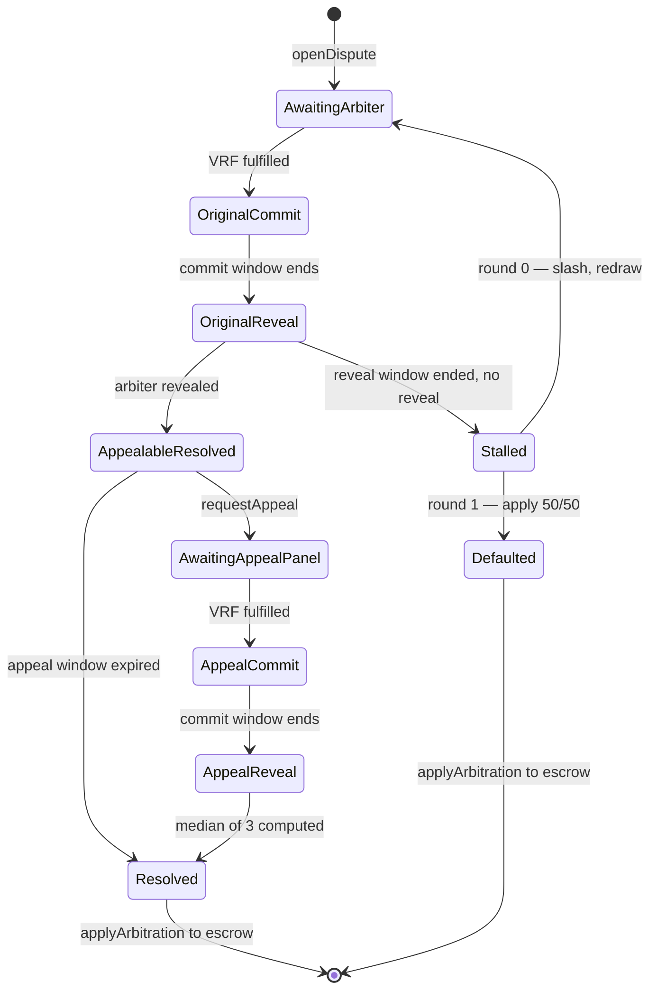
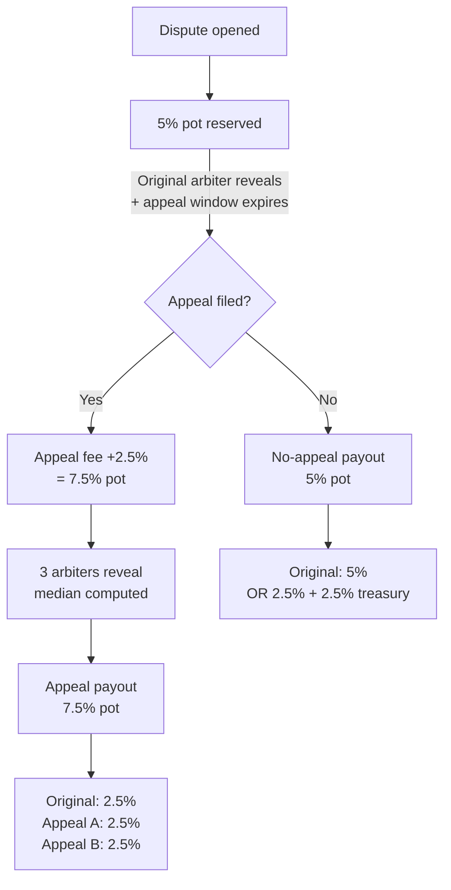
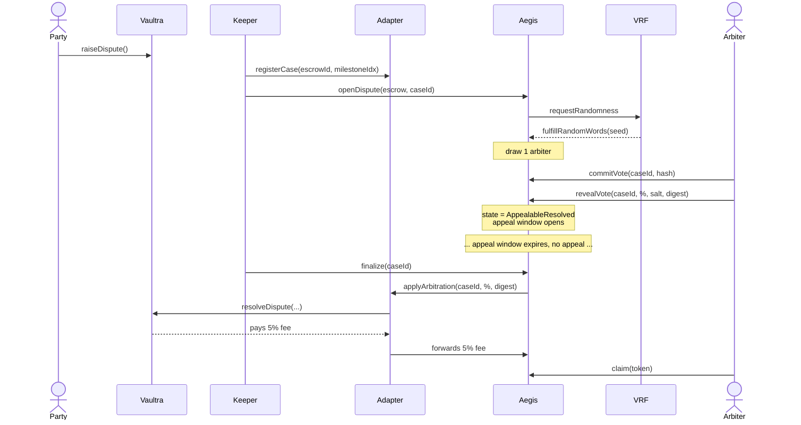
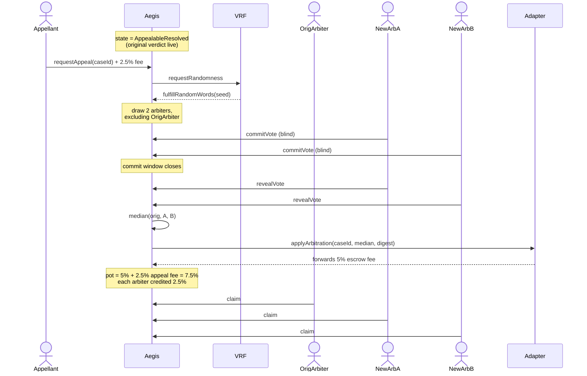
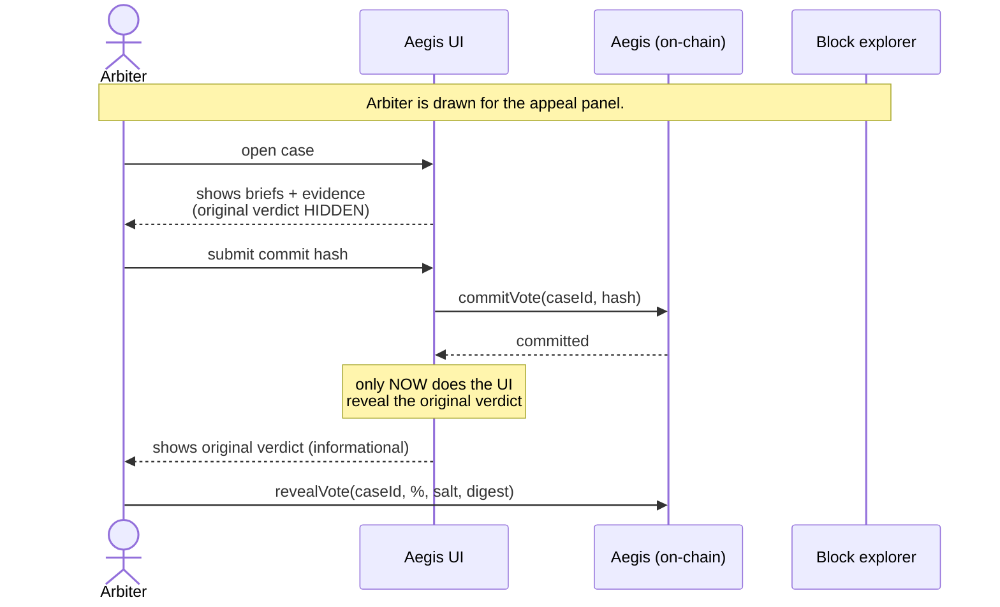
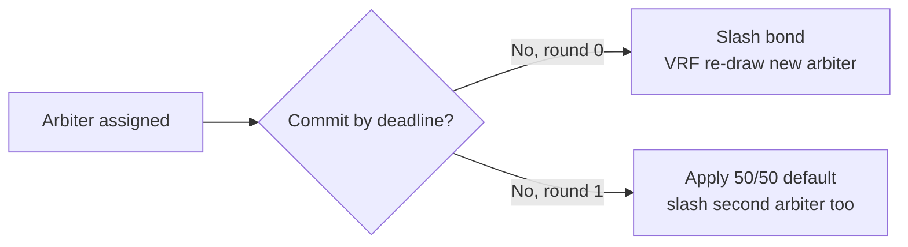
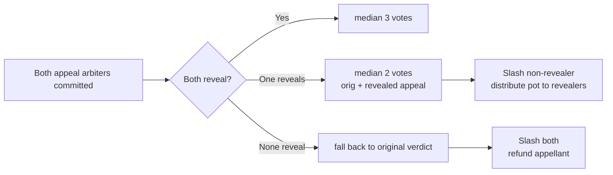

# Aegis arbitration redesign — single arbiter + appeal-quorum-of-3

Status: **draft** — design under discussion, not yet implemented.

## Motivation

The current design seats a 3–7 arbiter panel via VRF sortition for every
case, and a *fresh, larger* panel on appeal. This has three known
incentive problems:

1. **Appeal panels are biased toward overturning.** They only earn the
   escrow fee on overturn; on upheld they split a small ELCP bond. Their
   dominant strategy is to find fault with the original verdict.
2. **Per-arbiter pay is thin.** The 5% Vaultra arbitration cut split
   across a panel of 5–7 leaves each arbiter with under 1% of the
   disputed amount.
3. **The appeal bond is doing two incompatible jobs.** It's the only
   appeal-side revenue source AND the deterrent against frivolous
   appeals. Sized for one, it underperforms at the other.

This redesign collapses the original panel to a single arbiter and
treats the appeal as *augmenting* that arbiter into a 3-quorum, with
the original verdict retained as one of the three votes.

## Core idea

- **Original**: 1 VRF-sortitioned arbiter renders a verdict.
- **Appeal**: 2 additional VRF-sortitioned arbiters join (excluding the
  original). Final verdict = median of all 3 votes.
- A single corrupt appeal arbiter cannot swing the verdict alone —
  they need their peer to agree in the same direction.

## State machine



## Money flow

All percentages are of the disputed amount, denominated in the
escrow's fee token (e.g. USDC for Vaultra).

### Fee sources

| Source | Amount | Collected when | Visible to Aegis? |
|---|---|---|---|
| Vaultra platform fee | 2.5% | Escrow creation | No — stays at Vaultra |
| Payer dispute reserve | 2.5% | Escrow creation, activated on dispute | Yes, on `applyArbitration` |
| Payee cut | 2.5% | On dispute (deducted from payee's share) | Yes, on `applyArbitration` |
| Appeal fee | 2.5% | On `requestAppeal` (paid by appellant) | Yes, immediately |

### Pot routing



### No-appeal distribution

The 5% pot has two reasonable allocations (still **open**):

- **Option A** — `original = 2.5%`, `treasury = 2.5%`. Per-arbiter pay is
  consistent across the no-appeal and appeal paths.
- **Option B** — `original = 5%`, `treasury = 0%`. Original arbiter is
  rewarded extra for issuing a verdict that survives the appeal window.
  Lean: this option, since the appeal-window-survival case is the
  success path.

### Appeal distribution

The 7.5% pot is split equally among the 3 quorum members:

```
original = 2.5%
appeal arbiter A = 2.5%
appeal arbiter B = 2.5%
treasury = 0% (or trim a small slice from each if treasury revenue is desired)
```

The appeal fee always pays the new arbiters' work — regardless of
whether the median moves significantly from the original verdict.

### Appeal fee — consumed or refundable?

Under this design, "maintained vs overturned" is fuzzy because the
original vote is part of the median. Three options (still **open**):

- **Always consumed**: appellant always forfeits 2.5%. Simple, harsh on
  appellants who were genuinely correct.
- **Refund if median moved toward appellant by ≥ tolerance**: brings
  back a tunable `appealRefundThreshold` policy knob.
- **Proportional refund**: refund scales with how far the median moved
  toward the appellant's preferred outcome. Fairest, most complex.

Lean: **always consumed** for v1. The deterrent is the whole point of
the fee; refund logic can be added later if appellants complain.

### Slashing

- **Original arbiter is not slashed on overturn.** Their vote is
  retained as one of three; being outvoted by their peers is not
  misconduct.
- **Non-revealers (original or appeal) lose one `stakeRequirement`
  bond.** Same rule as the existing contract.
- **Peek-then-no-reveal** (appeal arbiter reads the original verdict
  via the explorer and refuses to reveal): same non-reveal slashing.
  The economic disincentive carries the integrity, not on-chain
  blinding.

## Sequence diagrams

### Happy path — no appeal



### Happy path — appeal filed



### Commit-before-peek protocol

The on-chain verdict is public the moment the original arbiter reveals.
"Blind" appeal voting is therefore enforced by the *Aegis UI* + the
non-reveal slashing penalty, not by cryptography.



**Threat model**: a determined arbiter can read `c.partyAPercentage`
directly from the contract via an explorer before committing. Defense:

1. **No incentive to peek-then-bail.** The arbiter's commit hash is
   binding. If they peek and dislike their commit, refusing to reveal
   costs them one `stakeRequirement` bond — typically more than they
   could earn by gaming a single case.
2. **Short commit window.** Set `commitWindow` short enough that a
   peek-and-recompute attack window is small.
3. **2-of-3 collusion barrier.** Even a peeking arbiter cannot swing
   the median alone; their peer must also disagree with the original
   in the same direction.

The blinding is therefore "soft" by cryptographic standards but
"hard" by economic standards. Acceptable.

## Edge cases

### E1. Original arbiter never commits



Same two-round pattern as the existing contract's `_stallAndRedraw` —
one redraw, then default verdict. Default percentage = 50.

### E2. Original arbiter commits but never reveals

Treated identically to E1 — slash, redraw, then default. The committed
hash is meaningless without the reveal; we cannot extract their vote.

### E3. One appeal arbiter doesn't reveal

The 3-quorum becomes a 2-quorum: original vote + 1 revealed appeal
vote. Median of 2 = arithmetic mean.



**Pot distribution when only one appeal arbiter reveals**:
`original = 2.5%`, `revealing appeal arbiter = 2.5%`, `slashed bond +
unspent 2.5% appeal-arbiter slot = treasury or appellant refund`.

### E4. Both appeal arbiters fail to reveal

Original verdict was effectively never overturned. The verdict that
goes back to the escrow is the original.

- Both appeal arbiters lose their bonds (treasury).
- Appellant is **refunded their 2.5% appeal fee** — the system
  failed them, they shouldn't pay for unpaid work.
- Original arbiter is paid the no-appeal rate (Option A or B above).

This is the one place the appeal fee is reliably refunded regardless
of which "always consumed / refund / proportional" rule we pick for
question 2.

### E5. VRF fails to fulfill

Same as today: case stuck in `AwaitingArbiter` or
`AwaitingAppealPanel`. The `/admin` page surfaces it as "VRF stuck"
after 1 hour. Manual remediation: governance can call a re-request
function or top up the LINK subscription.

No contract changes from current behavior.

### E6. Arbiter tries to unstake mid-case

`lockedStake[arbiter]` already prevents this in the current contract.
Single-arbiter cases lock exactly one `stakeRequirement` per case.
Appeal cases lock one additional bond per new arbiter on top.

### E7. Appellant is not a party to the dispute

`requestAppeal` reverts: only `partyA` or `partyB` can call it (same
as current contract).

### E8. Original arbiter is drawn again as an appeal arbiter

VRF draw must exclude `case.originalArbiter` from the eligible set.
The 3-quorum is supposed to be `original + 2 distinct new`. Drawing
the original twice would collapse the quorum to 2 effective voters.

### E9. Double-finalize / replayed `applyArbitration`

`finalize` checks the case state machine and reverts if not in a
finalizable state (same as current). The escrow's `applyArbitration`
is idempotent on the escrow side via `liveCaseFor` mapping.

### E10. Median is a tie / non-integer

Votes are `uint16` percentages 0–100. With 3 votes, the median is
always the middle value — a single integer, no ties. With 2 votes
(E3 fallback), use floor((a+b)/2) for determinism.

### Edge case summary

| # | Scenario | Disposition |
|---|---|---|
| E1 | Original no-commit | Slash, redraw round 0; default round 1 |
| E2 | Original no-reveal | Same as E1 |
| E3 | 1/2 appeal reveal | Median of 2 (orig + reveal); slash absent |
| E4 | 0/2 appeal reveal | Original verdict applies; refund appellant; slash both |
| E5 | VRF stuck | Same as today; manual remediation |
| E6 | Mid-case unstake | Blocked by `lockedStake` (no change) |
| E7 | Non-party appeal | Reverts (no change) |
| E8 | Original re-drawn for appeal | VRF excludes original arbiter |
| E9 | Double-finalize | State guard reverts (no change) |
| E10 | Tie median | Deterministic floor((a+b)/2) for 2-vote fallback |

## Storage layout impact

This is the contract-side change list, scoped to `blockchain/contracts/Aegis.sol`.

### Case struct

The current `Case` struct is panel-shaped (variable-size arrays for
panel members and votes). The new struct is fixed-shape with a clear
"original" slot and an optional "appeal" extension.

```text
Case {
    // Identity (unchanged)
    address escrow;
    bytes32 escrowCaseId;
    address partyA;
    address partyB;
    address feeToken;
    uint256 amount;

    // State (replaces panel arrays)
    address originalArbiter;
    bytes32 originalCommit;
    uint16  originalPercentage;   // 0-100, valid after reveal
    bytes32 originalDigest;
    uint64  originalCommitDeadline;
    uint64  originalRevealDeadline;
    bool    originalRevealed;

    // Appeal extension (zero unless appeal filed)
    address appellant;
    uint64  appealDeadline;       // appeal-window expiry
    address[2] appealArbiters;
    bytes32[2] appealCommits;
    uint16[2]  appealPercentages;
    bytes32[2] appealDigests;
    bool[2]    appealRevealed;
    uint64  appealCommitDeadline;
    uint64  appealRevealDeadline;
    uint256 appealFeeAmount;      // for refund accounting

    // Pot accounting (replaces _distributeFees inputs)
    uint256 escrowFeeReceived;    // 5% pot, set on applyArbitration return
    bool    feesDistributed;

    // State machine
    CaseState state;
    uint8 stallRound;             // 0 or 1 — same redraw cap as today
}
```

Key deletions from the current struct: the `panel[]` / `commits[]` /
`reveals[]` parallel arrays, the separate `Appeal` substruct, the
`originalPercentage` / `originalDigest` fields used only for staging
between original-resolution and appeal-finalization (those become the
*real* fields).

### Mapping changes

- `liveCaseFor[escrow][escrowCaseId]` — unchanged.
- `lockedStake[arbiter]` — unchanged. Locks one bond at original-draw
  time, locks two more at appeal-draw time.
- `claimable[arbiter][token]` — unchanged. Pull-pattern fee claims.
- `treasuryAccrued[token]` — unchanged.

### Function signatures

| Current | New | Notes |
|---|---|---|
| `commitVote(caseId, hash)` | `commitVote(caseId, hash)` | Same signature, contract internally routes to original or appeal slot based on `state` and `msg.sender` |
| `revealVote(caseId, %, salt, digest)` | unchanged | Same routing |
| `requestAppeal(caseId)` | unchanged | Pulls 2.5% appeal fee in escrow's fee token, not ELCP |
| `finalize(caseId)` | unchanged | Internal logic rewritten — no more upheld/overturned branching |
| `_drawPanelWithSeed(seed, ..., n)` | split: `_drawArbiter(seed, exclude)` and `_drawTwoArbiters(seed, exclude)` | Single-shot Fisher-Yates with `n=1` or `n=2` |
| `_resolveByMedian(panel, votes)` | `_medianOf3(a, b, c)` and `_medianOf2(a, b)` | Specialized; no sort needed for n=3 |
| `_finalizeAppeal(...)` | **removed** | The appeal IS the finalization; no separate call |
| `_settleOriginal(...)` | merged into `finalize` | Single resolution path |
| `_distributeFees(...)` | rewritten | Pot is 5% (no appeal) or 7.5% (appeal); split at fixed 2.5% per arbiter |
| `_stallAndRedraw(...)` | adapted for single-arbiter original | Round 0 redraws original; round 1 defaults to 50/50 |

### Policy struct changes

```text
policy {
    uint64  commitWindow;         // unchanged
    uint64  revealWindow;         // unchanged
    uint64  appealWindow;         // unchanged
    uint256 stakeRequirement;     // unchanged
    address treasury;             // unchanged

-   uint8   panelSize;            // REMOVED — now always 1
-   uint8   appealPanelSize;      // REMOVED — now always 2
-   uint16  panelFeeBps;          // REMOVED — flat 2.5% per arbiter
-   uint16  appealOverturnTolerance; // REMOVED — no upheld/overturned distinction
-   uint256 appealBondAmount;     // REMOVED — replaced by appealFeeBps
+   uint16  appealFeeBps;         // 250 = 2.5% of disputed amount
+   uint16  noAppealOriginalBps;  // 500 (Option B) or 250 (Option A)
+   uint16  perArbiterFeeBps;     // 250 = 2.5% per arbiter on appealed cases
}
```

The number of policy knobs **drops by 4** (panel sizes, fee bps,
tolerance, bond) and gains 3, for a net reduction of 1. Governance
proposals to "tune the panel" become unnecessary.

### Events

- `CaseRequested` — unchanged.
- `CaseOpened` — change `address[] panel` to `address arbiter`.
- `Committed` / `Revealed` — unchanged signatures; emitted for
  original-arbiter or appeal-arbiter equivalently.
- `CaseAppealable` — unchanged.
- `AppealRequested` — change to emit `appealFeeAmount` in escrow fee
  token instead of ELCP bond amount.
- `CaseResolved` — unchanged signature; emitted exactly once per case
  (no longer twice for staged-then-applied).
- New: `OriginalArbiterDrawn(caseId, arbiter)`,
  `AppealArbitersDrawn(caseId, [a, b])` for indexer clarity.

## Implementation phases

A realistic order of operations for the rewrite. Each phase ends in
a green test suite for the slice it touches.

### Phase 0 — Spec freeze (you, ~30min)

Answer the two open questions in this doc:
1. Option A or B for no-appeal payout.
2. Always-consumed vs threshold-refund vs proportional-refund for
   the appeal fee.

Without these locked, phases 2 and 4 will need rework.

### Phase 1 — Branch + scaffolding (~15min)

```bash
git checkout main
git pull
git checkout -b feat/single-arbiter-appeal-quorum
```

Move this design doc to the new branch's history (cherry-pick or
merge from `claude/review-frontend-design-cR73L`).

### Phase 2 — Contract storage + state machine (~half day)

- Rewrite `Case` struct per the layout above.
- Update `CaseState` enum to match the state diagram.
- Stub all functions to compile but revert with `NotImplemented`.
- Confirm `forge build` / `pnpm contracts:compile` is green.

### Phase 3 — Original arbiter flow (~half day)

- `openDispute` → VRF request.
- `fulfillRandomWords` → `_drawArbiter` + state transition.
- `commitVote` / `revealVote` for the original-arbiter slot.
- `finalize` for the no-appeal path.
- `applyArbitration` callback.
- `_distributeFees` for the 5% no-appeal pot.

Tests: a full happy-path no-appeal case.

### Phase 4 — Appeal flow (~full day)

- `requestAppeal` — pull appeal fee, gate on appeal window, request VRF.
- `fulfillRandomWords` (appeal branch) — draw 2 excluding original.
- `commitVote` / `revealVote` for appeal slots.
- `finalize` for the appeal path — `_medianOf3`, fee distribution
  across 7.5% pot.
- Edge cases E3, E4, E10 from above.

Tests: appeal happy-path, partial-reveal, full-non-reveal.

### Phase 5 — Stall + redraw (~quarter day)

- Two-round stall logic for the original arbiter (E1, E2).
- Slashing of non-revealing original arbiters.
- Slashing of non-revealing appeal arbiters with appellant refund
  on full non-reveal (E4).

Tests: stall-then-redraw and stall-then-default for both phases.

### Phase 6 — ABI export + type regen (~30min)

```bash
pnpm contracts:export-abi
pnpm typecheck
```

Fix all type errors in `app/`, `lib/keeper/`, `components/`. Most
will be enum value changes and the `panel[]` → `arbiter` shift.

### Phase 7 — Keeper updates (~half day)

- New event handlers in `lib/keeper/aegis-indexer.ts` for
  `OriginalArbiterDrawn`, `AppealArbitersDrawn`.
- DB schema migration: rename `panel_*` columns to `arbiter_*` /
  `appeal_arbiters_*` per the new model.
- Auto-finalize logic for the simplified paths.

### Phase 8 — Frontend updates (~full day)

- `components/commit-reveal-form.tsx` — gate visibility of the
  original verdict in the appeal-phase UI (commit-before-peek).
- `components/case-timeline.tsx` — render single-arbiter then
  appeal-augmentation.
- `components/appeal-button.tsx` — show 2.5% appeal fee in the
  escrow's token (not ELCP).
- `app/cases/[id]/page.tsx` — strip panel-grid UI in favor of
  arbiter-card UI.

### Phase 9 — Security review pass (~half day)

- Re-run `docs/security-review.md` checklist against the new code.
- Add new findings for the commit-before-peek threat model and the
  median-of-2 fallback.
- Get external eyes before mainnet deploy.

### Estimated total

Roughly **3.5–4 working days** of focused work assuming no surprises.
The contract phases (2–5) are where most of the risk lives; the UI
and keeper phases are mostly mechanical translation.

## Open questions still on the table

1. **No-appeal payout to original arbiter.** Option A (2.5% +
   treasury) vs Option B (full 5% to arbiter).
2. **Appeal-fee refund mechanics.** Always consumed vs threshold
   refund vs proportional refund.
