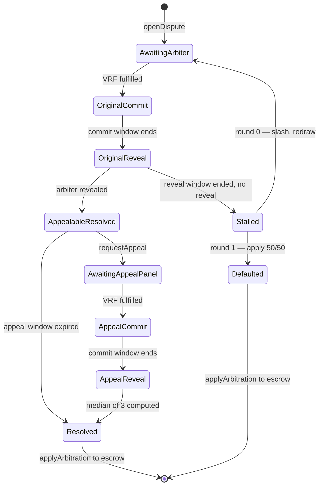
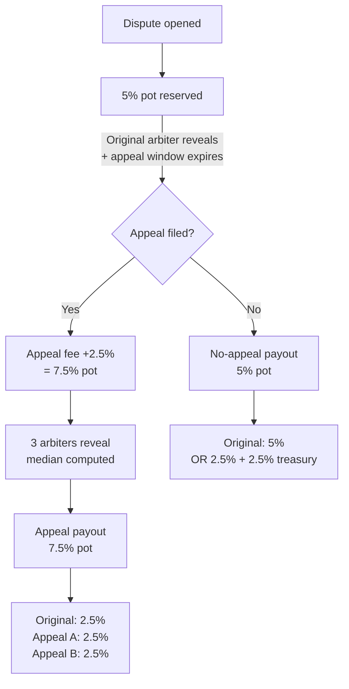

# Aegis arbitration redesign — single arbiter + appeal-quorum-of-3

Status: **draft** — design under discussion, not yet implemented.

## Motivation

The current design seats a 3–7 arbiter panel via VRF sortition for every
case, and a *fresh, larger* panel on appeal. This has three known
incentive problems:

1. **Appeal panels are biased toward overturning.** They only earn the
   escrow fee on overturn; on upheld they split a small ELCP bond. Their
   dominant strategy is to find fault with the original verdict.
2. **Per-arbiter pay is thin.** The 5% Vaultra arbitration cut split
   across a panel of 5–7 leaves each arbiter with under 1% of the
   disputed amount.
3. **The appeal bond is doing two incompatible jobs.** It's the only
   appeal-side revenue source AND the deterrent against frivolous
   appeals. Sized for one, it underperforms at the other.

This redesign collapses the original panel to a single arbiter and
treats the appeal as *augmenting* that arbiter into a 3-quorum, with
the original verdict retained as one of the three votes.

## Core idea

- **Original**: 1 VRF-sortitioned arbiter renders a verdict.
- **Appeal**: 2 additional VRF-sortitioned arbiters join (excluding the
  original). Final verdict = median of all 3 votes.
- A single corrupt appeal arbiter cannot swing the verdict alone —
  they need their peer to agree in the same direction.

## State machine



## Money flow

All percentages are of the disputed amount, denominated in the
escrow's fee token (e.g. USDC for Vaultra).

### Fee sources

| Source | Amount | Collected when | Visible to Aegis? |
|---|---|---|---|
| Vaultra platform fee | 2.5% | Escrow creation | No — stays at Vaultra |
| Payer dispute reserve | 2.5% | Escrow creation, activated on dispute | Yes, on `applyArbitration` |
| Payee cut | 2.5% | On dispute (deducted from payee's share) | Yes, on `applyArbitration` |
| Appeal fee | 2.5% | On `requestAppeal` (paid by appellant) | Yes, immediately |

### Pot routing



### No-appeal distribution

The 5% pot has two reasonable allocations (still **open**):

- **Option A** — `original = 2.5%`, `treasury = 2.5%`. Per-arbiter pay is
  consistent across the no-appeal and appeal paths.
- **Option B** — `original = 5%`, `treasury = 0%`. Original arbiter is
  rewarded extra for issuing a verdict that survives the appeal window.
  Lean: this option, since the appeal-window-survival case is the
  success path.

### Appeal distribution

The 7.5% pot is split equally among the 3 quorum members:

```
original = 2.5%
appeal arbiter A = 2.5%
appeal arbiter B = 2.5%
treasury = 0% (or trim a small slice from each if treasury revenue is desired)
```

The appeal fee always pays the new arbiters' work — regardless of
whether the median moves significantly from the original verdict.

### Appeal fee — consumed or refundable?

Under this design, "maintained vs overturned" is fuzzy because the
original vote is part of the median. Three options (still **open**):

- **Always consumed**: appellant always forfeits 2.5%. Simple, harsh on
  appellants who were genuinely correct.
- **Refund if median moved toward appellant by ≥ tolerance**: brings
  back a tunable `appealRefundThreshold` policy knob.
- **Proportional refund**: refund scales with how far the median moved
  toward the appellant's preferred outcome. Fairest, most complex.

Lean: **always consumed** for v1. The deterrent is the whole point of
the fee; refund logic can be added later if appellants complain.

### Slashing

- **Original arbiter is not slashed on overturn.** Their vote is
  retained as one of three; being outvoted by their peers is not
  misconduct.
- **Non-revealers (original or appeal) lose one `stakeRequirement`
  bond.** Same rule as the existing contract.
- **Peek-then-no-reveal** (appeal arbiter reads the original verdict
  via the explorer and refuses to reveal): same non-reveal slashing.
  The economic disincentive carries the integrity, not on-chain
  blinding.

## Open questions still on the table

1. **No-appeal payout to original arbiter.** Option A (2.5% +
   treasury) vs Option B (full 5% to arbiter).
2. **Appeal-fee refund mechanics.** Always consumed vs threshold
   refund vs proportional refund.
