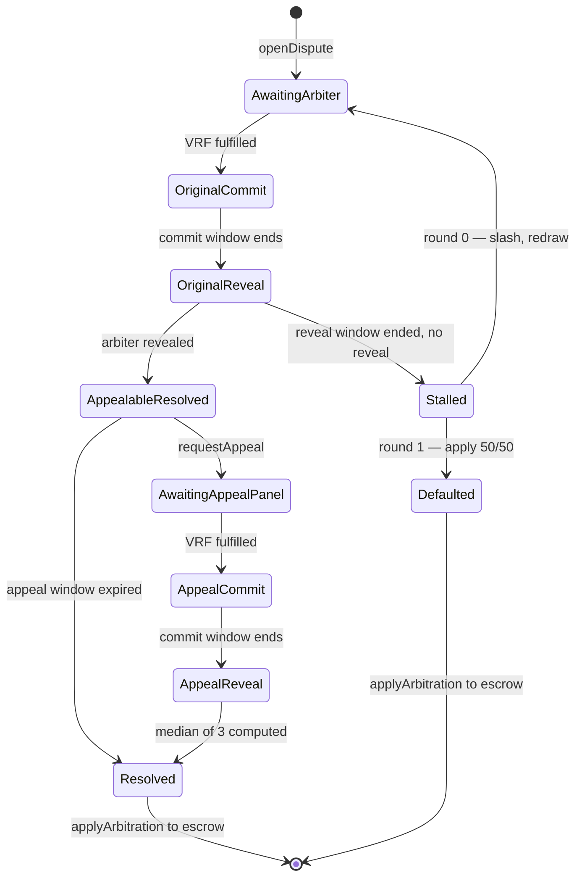

# Aegis arbitration redesign — single arbiter + appeal-quorum-of-3

Status: **draft** — design under discussion, not yet implemented.

## Motivation

The current design seats a 3–7 arbiter panel via VRF sortition for every
case, and a *fresh, larger* panel on appeal. This has three known
incentive problems:

1. **Appeal panels are biased toward overturning.** They only earn the
   escrow fee on overturn; on upheld they split a small ELCP bond. Their
   dominant strategy is to find fault with the original verdict.
2. **Per-arbiter pay is thin.** The 5% Vaultra arbitration cut split
   across a panel of 5–7 leaves each arbiter with under 1% of the
   disputed amount.
3. **The appeal bond is doing two incompatible jobs.** It's the only
   appeal-side revenue source AND the deterrent against frivolous
   appeals. Sized for one, it underperforms at the other.

This redesign collapses the original panel to a single arbiter and
treats the appeal as *augmenting* that arbiter into a 3-quorum, with
the original verdict retained as one of the three votes.

## Core idea

- **Original**: 1 VRF-sortitioned arbiter renders a verdict.
- **Appeal**: 2 additional VRF-sortitioned arbiters join (excluding the
  original). Final verdict = median of all 3 votes.
- A single corrupt appeal arbiter cannot swing the verdict alone —
  they need their peer to agree in the same direction.

## State machine

## Open questions still on the table

1. **No-appeal payout to original arbiter.** Either 2.5% (treasury
   keeps the other 2.5%) or 5% (incentive to issue uncontroversial
   verdicts).
2. **Appeal-fee refund mechanics.** Always consumed (simple deterrent),
   refund-on-significant-movement (fairer, brings back tolerance
   threshold), or proportional refund (fairest, most complex).
