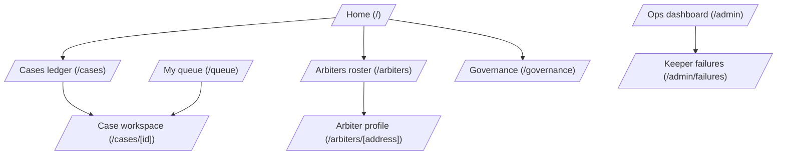

# Aegis — UX design spec

A design brief for the frontend. Aegis is an Eclipse-DAO-administered
arbitration court that resolves escrow disputes via VRF-sortitioned
arbiters. This document covers screens, flows, design language, and
cross-cutting UX invariants — particularly the **de novo blindness**
property that constrains what arbiters can see.

Status: **draft** — coupled to the arbitration redesign in
`docs/arbitration-redesign.md`. The new design replaces panels of
3–7 arbiters with a single original arbiter + 2-arbiter appeal
augmentation; the UI must reflect this shift.

## Design language

Aegis is a **court**, not a marketing site. The vibe is text-dense,
utilitarian, and monochrome — closer to GitHub Issues or a docket
viewer than a consumer dapp. The user is here to do administrative
work (file briefs, cast votes, review verdicts), not to be delighted
by motion design.

### Palette

- **Base**: zinc 50 / 950 (light / dark). System color-scheme aware.
- **Borders**: zinc 200 / 800. Subtle, never busy.
- **Surfaces**: white / zinc 950. Cards float on the base.
- **Text**: zinc 900 / 100 primary, zinc 500/400 muted, zinc 400/500
  even more muted (for hints, timestamps, asides).
- **Accent (action)**: zinc 900 / 100 inverted — the primary button
  is high-contrast, not colored. The system uses no brand color.
- **State colors** (used sparingly in badges and admin):
  - amber for warnings / "needs attention"
  - red for errors / overdue / slashed
  - emerald for resolved / paid
  - sky for in-progress / awaiting

The point of avoiding a brand color is that this is **infrastructure**.
A neutral palette signals seriousness; bright colors would feel
out of place in a courtroom context.

### Typography

- Single sans-serif throughout (system stack).
- `font-feature-settings: "ss01" on, "cv11" on` already configured —
  enables ligature + alt forms for cleaner numerals.
- Code / addresses / case IDs in `font-mono text-xs`. Always.
- Headlines: `text-3xl font-semibold tracking-tight` for h1,
  `font-medium` for h2.
- Body: 14-15px (`text-sm` and `text-base`). Long-form briefs at
  `text-base leading-7` so they're readable.

### Density and rhythm

- Maximum content width: `max-w-5xl` centered. Wider feels web-y.
- Section spacing: `space-y-8` between top-level sections,
  `space-y-4` within.
- Cards: `p-4`, rounded-lg, subtle shadow, 1px border. No drop
  shadows beyond the existing `shadow-sm`.
- Tables (cases ledger, arbiters list): zebra striping is fine but
  not required; row borders work.

### Component primitives (already in `styles/globals.css`)

- `.card` — bordered surface with shadow-sm.
- `.btn-primary` — high-contrast filled button.
- `.btn-secondary` — bordered, surface-colored button.
- `.input` — bordered text input, mono font for hashes.
- `.badge` — pill, used for case status, arbiter status.

Designer should treat these as the seed; expand the kit only when
truly needed (don't introduce a fifth button variant unless you can
explain the semantic difference).

## Information architecture

### Auth-gated routes

- **Public** (no wallet required): Home, Cases ledger, Arbiters
  roster, Governance proposal builder (read), Case workspace
  (party identities + briefs visible only post-resolution).
- **SIWE-required**: My queue, Case workspace party-side actions
  (file brief, request appeal), arbiter actions (commit, reveal,
  recuse), arbiter profile encryption setup.
- **Role-gated within auth**: Arbiter actions only render when the
  signed-in wallet is on the case's panel; admin pages may be
  unrestricted-read but the underlying RPC keys live elsewhere.

### Top nav

A single bar across the top with: wordmark · Cases · My queue ·
Arbiters · Governance · Ops (muted) · SIWE sign-in button on the
right. Already implemented; designer should treat it as canonical
and not invent additional global nav.

## User roles and contexts

Aegis has more user types than a typical dapp. The same wallet may
be in multiple roles across different cases. **Each screen needs to
render correctly for whichever role the viewer currently holds for
the resource they're looking at.**

### Visitor (no wallet, or signed-out)

- Reads the public ledger of cases.
- Sees post-resolution data (verdict, parties, fee distribution).
- **Cannot see** arbiter identities for in-flight cases (D13
  anonymity), in-flight briefs, or commit hashes that haven't been
  revealed.

### Party (plaintiff / defendant)

A party is one of `partyA` or `partyB` on a specific case. They've
already gone through Vaultra's escrow setup (or another integrated
escrow) and are now in dispute.

- Files briefs (encrypted off-chain to arbiters).
- Watches the case progress through states.
- Decides whether to appeal (D12 gate: only if they didn't fully win).
- Claims any verdict-weighted rebate (D1(c)).

A party knows full context of their own case. Their UI shows
everything: state, deadlines, original verdict (after reveal),
appeal status, etc.

### Arbiter

An arbiter is a registered, ELCP-staked wallet. They may be drawn
for a case via VRF (1 arbiter for original, or 1 of 2 for appeal).

**Critical UX requirement (de novo)**: an arbiter's UI must NOT
distinguish between original and appeal cases when they're drawn.
They see "a case to arbitrate" — same shape, same fields, same
flow. They commit + reveal a vote. They never see whether a prior
verdict exists for this case, who other arbiters are, or that
they're contributing to a median rather than rendering solo. See
the "Critical UX invariants" section below for the enforcement
checklist.

When an arbiter is NOT acting as an arbiter — e.g., they're
viewing the public ledger or their own profile — they see normal
public information.

### Governance member (DAO)

A member of the Eclipse DAO's multisig. They use the governance
calldata builder to compose policy / roster proposals that go to
the DAO timelock.

This is a power-user flow. Visual design can be denser and more
technical than the party / arbiter views.

### Admin / operator

Whoever runs the keeper / monitors the system. Reads the ops
dashboard for keeper liveness, VRF stuck cases, indexer cursor
lag, and the failure log. Read-only UI; remediation happens
out-of-band (top up VRF subscription, restart keeper, etc.).

### Same-wallet, multi-role example

Wallet `0xAlice` could simultaneously be:
- A party in case #42 (her dispute with Bob)
- An arbiter for case #71 (a different dispute she was drawn into)
- A DAO multisig signer (when wearing her governance hat)

The UI must contextualize correctly: when Alice opens case #71's
workspace, she sees the arbiter UX (de novo sanitized). When she
opens case #42's workspace, she sees the party UX. The route is
the same; the rendering branches on role detection.

## Screens

### Home (`/`)

Landing page. Already implemented; designer should refresh.

**Above the fold**:
- H1 "Aegis" + 2-line description: "Eclipse-DAO arbitration. Vetted,
  ELCP-staked arbiters resolve disputes for any escrow protocol that
  implements `IArbitrableEscrow`."
- No hero image, no marketing flourish. This is a court, not a SaaS.

**Below**:
- 2×2 grid of `.card` tiles, each linking to a top-level area:
  - **Cases ledger** — public list of opened, in-flight, and resolved cases
  - **Arbiters** — registered roster, ELCP stake, on-chain case counts
  - **Governance bridge** — calldata builder for DAO proposals
  - **Plug in your escrow** — static info card pointing at integration docs

**No personalization.** Even if signed in, the home page doesn't
default to "your queue." That would couple a public landing to a
wallet state in a confusing way. If a user wants their queue, they
click "My queue" in the nav.

**Footer**: GitHub link, security review, integration docs. Tiny,
muted, single line.

### Cases ledger (`/cases`)

The public docket. Lists all cases on the indexed Aegis instance.

**Header**:
- H1 "Cases"
- Filter chips below: All · In flight · Resolved · Defaulted (or
  similar). Count badges next to each.
- Optional: Search by caseId / party address.

**Table** (or feed of rows; a table works fine here):
- Columns: Case ID (mono, truncated) · Parties (mono, both addresses
  or ENS if available, truncated) · Amount (USDC formatted) · Status
  (badge) · Opened (relative time)
- Click row → case workspace.
- Status badge color: amber for in-flight, sky for committed but not
  resolved, emerald for resolved, red for defaulted/stalled.

**Pagination**: simple "load more" or numbered. The public ledger
will grow; don't try to render 10,000 rows at once.

**Empty state**: "No cases on this Aegis instance yet" + link to
the integration doc. Avoid stock illustrations; just text.

**Per-case privacy**: D13 soft anonymity — the public row should
NOT show assigned arbiter addresses for in-flight cases. After
resolution, arbiter addresses are visible (or governance-config
to remain hidden). Designer to confirm with PM whether even
post-resolution arbiter identity is suppressed.

### Case workspace (`/cases/[id]`)

The most important and complex screen. Renders dramatically
differently for the three viewer types: **public visitor**,
**party**, **arbiter (de novo)**.

#### Shared shell (all viewers)

- Breadcrumb: Cases · #abcdef… (truncated case ID)
- H1: "Case #abcdef…" with a copy-button next to the full ID.
- Subtitle: parties + amount + escrow source. E.g.,
  "Alice ↔ Bob · 1,000 USDC · Vaultra escrow".
- Status badge in the top right.

The shell is the same. The body splits:

#### Party view

The party knows everything. Render the full case context.

**Sections** (top to bottom, vertical stack):

1. **Status panel** — current state, deadline countdown(s), what
   action the user can take. E.g., during the appeal window, this
   panel surfaces a "Request appeal" button (gated by D12 — full
   winners can't appeal; gray it out with an inline explanation).

2. **Briefs** — both parties' briefs, side-by-side on desktop or
   stacked on mobile. Editable for the viewer's own brief while
   the case is in `Voting` (i.e., before the arbiter reveals);
   read-only after. Encrypted briefs render through
   `encrypted-brief-viewer.tsx` — a "decrypt" button if the viewer
   has a key registered, plain text view otherwise.

3. **Evidence panel** — file attachments, off-chain references.
   Existing component `evidence-panel.tsx` covers this.

4. **Verdict & timeline** — once the original arbiter reveals,
   show the verdict prominently (e.g., "Verdict: 60% to you, 40%
   to Bob"). Below it, a chronological timeline of state
   transitions: "Dispute opened → Arbiter drawn → Vote committed
   → Vote revealed → Appeal window: 3d 14h remaining". Use the
   existing `case-timeline.tsx`.

5. **Appeal action** (if appeal window open and viewer is eligible
   per D12). Existing component `appeal-button.tsx` — show the
   appeal fee in the escrow's fee token (e.g., "2.5% of disputed
   amount = 25 USDC"). Two-step UX: "Request appeal" button →
   confirmation modal showing the fee + an explanation that this
   triggers a fresh 2-arbiter panel.

6. **Fee distribution** (post-resolution) — collapsible card
   showing arbiter pay, party rebates per D1(c), claim button if
   the viewer has anything to claim.

#### Arbiter view (DE NOVO — critical)

The arbiter is here to do their job. They see exactly what the
original arbiter would see for any case, regardless of whether
they were drawn for the original or an appeal slot.

**Visible**:
- Briefs from both parties (encrypted; arbiter must have an
  encryption key registered to decrypt — see Arbiter profile)
- Evidence
- Their own commit/reveal status
- The deadline they need to act by (either commit deadline or
  reveal deadline, whichever is current)
- The disputed amount
- Their fee on resolution

**Not visible**:
- Whether this case is original or appeal phase
- Any prior verdict (the original arbiter's reveal, when they
  themselves are an appeal arbiter)
- The other appeal arbiter's identity or vote
- The case's full timeline / event history
- The state badge (or it shows a generic "Voting" with no phase
  distinction)

**Layout**:
- The same shell + status panel up top, but the status panel only
  surfaces "Submit your commit" or "Reveal your vote" with a
  countdown. No "this is an appeal" copy. No "the original
  arbiter ruled X, your role is to confirm or overturn."
- Briefs are just briefs. Same component as party view, but the
  arbiter sees both.
- Commit/reveal form is the existing `commit-reveal-form.tsx`,
  reworked to drop any "appeal" labels (D14 keeps the word
  "arbiter" everywhere; never "panelist" or "judge").
- Recuse button is available before they've committed. Wire it to
  the contract's `recuse(caseId)`.

**The hard part for the designer**: making sure the page
"feels normal" for an appeal arbiter. They should not get the
sense that anything is missing. Test by mocking up both an
original-phase and appeal-phase case for the same arbiter — the
two should be indistinguishable to them.

#### Public visitor view

Same shell. Body shows:
- Briefs only after resolution (D13 / privacy — until the case is
  closed, the briefs aren't public).
- Verdict, timeline, fee distribution post-resolution.
- During flight: just status + parties + amount. No briefs, no
  arbiter identities.

This is the "public docket" view that lets observers see what the
court has done historically without leaking in-flight details.

### My queue (`/queue`)

The signed-in arbiter's worklist. Lists cases where the connected
wallet is currently the original arbiter or filling an appeal slot.

**Header**:
- H1 "My queue"
- Subtle subhead: "Cases where you're the assigned arbiter."
- Onboarding banner if encryption isn't configured: "You haven't
  set up your encryption key. You won't be able to read encrypted
  briefs until you do." → link to arbiter profile.

**List of case rows**:
- Case ID (mono, truncated)
- Disputed amount
- Action required: "Commit by 14:32 today" / "Reveal by tomorrow
  09:00" — the most urgent action with a relative deadline.
- Per-row CTA: "Open" → case workspace.

**Sort by urgency**: cases closest to deadline first. Overdue
cases (where the arbiter has missed a window) marked in red as
"Overdue — slashing imminent".

**De novo enforcement**: queue rows are intentionally
undifferentiated. No "Original" / "Appeal" labels. Same row shape
for both. The arbiter just sees "cases I need to act on."

**Empty state**: "No cases assigned to you. New cases are drawn
randomly from the eligible arbiter pool. Make sure you have
sufficient ELCP staked to be eligible."

### Arbiters roster (`/arbiters`)

Public list of registered arbiters.

**Header**: H1 "Arbiters" + subhead about the roster being
DAO-curated.

**Table**:
- Address (mono, truncated, with ENS if available)
- Status (active / revoked) — badge
- ELCP staked
- Cases handled (lifetime count from `caseCount`)
- Joined (relative time of `ArbiterRegistered` event)

**No verdict history**: D13 anonymity — don't expose per-arbiter
verdict patterns publicly. The aggregate count is fine; specific
verdicts attached to specific arbiters could enable bribery
targeting. Designer should confirm this with PM.

**Sort**: defaults to "active first, then by ELCP staked desc".
Optional sort toggles for cases-handled or join date.

**Empty state**: "No arbiters registered yet" + governance link.

### Arbiter profile (`/arbiters/[address]`)

Two distinct UX patterns depending on viewer:

#### Public profile (anyone)

- Address (mono, full, with copy button) + ENS
- Status badge
- ELCP staked
- Cases handled (count only — no list of specific cases per D13)
- Credential CID (linked to the off-chain pointer)
- Joined date

That's it. No verdict history, no reputation score (yet).

#### Self profile (signed-in wallet matches the address)

The arbiter sees additional sections for managing their setup:

1. **Encryption key** — status (configured / not), public key
   fingerprint, "Rotate key" action. Existing component
   `configure-encryption.tsx`. If not configured, prominent CTA
   to set it up — without an encryption key, the arbiter can't
   decrypt briefs and shouldn't take cases.

2. **Stake management** — current staked amount, locked vs free
   stake (with explanation: "Locked stake is bonded to active
   cases and can't be withdrawn until those resolve"). Stake /
   unstake actions.

3. **Pending claims** — claimable arbiter fees in any token,
   with a "Claim" button per token. Wire to the contract's
   `claim(token)`.

4. **D13 cooldowns** — optional admin-style readout of which
   party-pairs the arbiter is currently excluded from arbitrating
   (per the 90-day cooldown). Useful for the arbiter to
   understand their effective availability. Skip for v1 if
   designer wants tighter scope.

### Governance (`/governance`)

Calldata builder for Eclipse DAO proposals. Power-user UI.

**Layout**: form-driven, single column.

**Sections** (each is a form that produces calldata):

1. **Update policy** — fields for each Policy struct member
   (commitWindow, revealWindow, graceWindow, appealWindow,
   repeatArbiterCooldown, stakeRequirement, appealFeeBps,
   perArbiterFeeBps, treasury). Pre-fill with current values.
   Generate `setPolicy(...)` calldata + show the encoded bytes
   for the multisig signer to copy into the DAO timelock UI.

2. **Roster: register arbiter** — address + credentialCID.
   Generates `registerArbiter(...)` calldata.

3. **Roster: revoke arbiter** — address. Generates
   `revokeArbiter(...)` calldata. Warning: this slashes the
   arbiter's full stake to treasury.

4. **Pause / unpause new cases** — toggle. Generates
   `setNewCasesPaused(...)` calldata.

5. **Withdraw treasury** — token + amount + recipient. Generates
   `withdrawTreasury(...)` calldata.

**Output**: a code block with the encoded calldata bytes, target
contract address, and a copy button. Plus a "verify" view
showing the decoded fields next to the bytes so the signer can
sanity-check before submitting upstream.

This is purposefully minimalist; the heavy lifting (proposal
submission, voting, execution) happens in the DAO's own UI. Aegis's
governance page just helps build the right calldata.

### Ops dashboard (`/admin`)

Operator-facing diagnostics. Read-only; remediation happens
out-of-band (refilling LINK, restarting keeper, etc.).

**Health tiles** (top row, 4 across on desktop):

1. **Keeper liveness** — cursor lag in seconds + status traffic
   light: green (<5min), amber (5–60min), red (>60min). Last
   indexed block + timestamp.

2. **VRF subscription** — LINK balance on the configured
   coordinator subscription. Amber if low, red if zero.

3. **Stuck cases** — count of cases in `AwaitingArbiter` or
   `AwaitingAppealPanel` for >1h (probable VRF stall). Click
   for the list.

4. **Case backlog** — total in-flight cases, distribution by
   state.

**Recent events feed** — chronological list of recent on-chain
events. Useful for at-a-glance "is the system breathing?"
checking. Filter by event type. Click an event to jump to the
related case.

**Failure log preview** — top 3 most recent unresolved keeper
failures with link to the full failures page.

This page is intentionally information-dense. Operators want to
see everything at a glance, not click through tabs.

### Keeper failures (`/admin/failures`)

The full table of failed keeper operations. Existing component
`admin-failure-row.tsx`.

**Columns**: When · Failure type (registerCase / openDispute /
finalize / etc.) · Vaultra escrow ID · Reason (truncated) · Attempts
counter · Last attempted · Resolution (button: "mark resolved" if
admin handled it out-of-band).

**Actions**:
- "Mark resolved" — admin closes the failure record (e.g., they
  manually called the failed function from a script).
- "Retry now" — kick the keeper to retry this specific item
  immediately (if applicable).

**Filters**: status (open / resolved) · age · failure type.

**Empty state**: "No keeper failures recorded. ✓"

### SIWE sign-in flow

Existing `sign-in-button.tsx`. Standard pattern:

1. **Disconnected**: button reads "Connect wallet". On click,
   shows the wallet selection modal (wagmi connectors).

2. **Connected, not signed in**: button reads "Sign in" + a small
   address chip. On click, the wallet pops up to sign the SIWE
   message. After signing, button shows the address chip + a
   chevron for a dropdown menu (My queue · Profile · Sign out).

3. **Signed in, wrong chain**: button reads "Switch network" in
   amber. Clicking prompts the wallet to switch.

**SIWE message** is iron-session-backed (already implemented).
Designer doesn't need to touch the cryptography; just the UI
states above.

**Edge cases the designer should mock up**:
- Wallet rejected the connection → toast: "Connection cancelled"
- Wallet rejected the SIWE signature → toast: "Sign-in cancelled"
- Network mismatch → persistent banner at the top of the page
  (not a toast) until user switches.
- Session expired → auto-prompt re-sign on the next protected
  action, not on every page load.

## Cross-cutting concerns

### Loading states

- Skeletons over spinners. A loading row in the cases table looks
  like the row, just with a pulsing zinc-100/800 stripe instead of
  text. Same for arbiter cards and case workspace sections.
- Initial route load: zinc-100 background pulse while server
  components render. Don't show a full-page spinner — Next.js's
  streaming behavior should hand off section-by-section.
- Tx submitting: button text changes to "Confirming…" with no
  spinner; the wallet handles its own UI. After tx hash, "Waiting
  for confirmation…" with a small linked tx hash.

### Empty states

Always text-first. No cute illustrations.

- "No cases yet"
- "No arbiters registered yet"
- "No keeper failures recorded ✓"
- "Your queue is empty. New cases are drawn randomly."

If there's a relevant action, link to it inline. Don't build big
empty-state cards with hero illustrations — that's a consumer-app
pattern that doesn't fit the court vibe.

### Error states

- **Inline errors** for form validation. Below the field, red text,
  no icons.
- **Banner errors** for actions that span the page (e.g., "Tx
  reverted: NotEnoughArbiters"). Top of the affected section,
  dismissible.
- **Toast errors** for transient issues (RPC timeout, wallet
  cancellation). Top-right, auto-dismiss after 5s.

Error copy: surface the contract revert reason verbatim when
useful. Don't translate `NotEnoughArbiters()` into "Something
went wrong" — the user (especially admin) wants the real signal.
For party / arbiter UX, wrap the technical name in friendly
context: "The arbiter pool is too small to draw a new panel.
Governance is recruiting; try again soon."

### Notifications / toasts

Used sparingly. Triggered on:
- Tx confirmed (linked to explorer)
- Brief saved
- Encryption key configured
- Stake / unstake completed
- Claim received

Don't notify on every read or every navigation. Toasts are for
"something happened that the user took an action to cause."

### Mobile

Aegis is primarily a desktop app — the use cases (filing briefs,
reviewing evidence, governance calldata builder) are
laptop-friendly. But the public ledger and case workspace should
be readable on phone.

- **Phone**: stacked single column. Cases ledger becomes a list of
  cards instead of a table. Case workspace sections stack
  vertically (briefs become tabs: "Your brief / Their brief"
  rather than side-by-side).
- **Don't ship**: governance calldata builder, admin dashboard.
  Hide them behind a "use desktop" message on phone — they're
  power-user surfaces and a cramped phone UI invites mistakes.
- **Touch targets**: 44px minimum on phone. The current tight
  density needs loosening on mobile.

### Real-time updates

The app polls (or subscribes to events) for state changes. The
UI should re-render gracefully when:
- A new VRF arbiter is drawn (case status flips)
- An arbiter commits or reveals (deadline display updates)
- An appeal is filed (state flips, party UI gains/loses appeal
  button)

Use optimistic updates for actions the user just took (e.g., they
just filed a brief — show it immediately rather than waiting for
the next poll).

## Critical UX invariants

These are non-negotiable and the designer must internalize them
before designing any arbiter-facing flow.

### 1. De novo arbiter blindness

Already covered above; restating the checklist:

- Arbiter UI must NOT show: case state name (badge), prior
  verdict, peer arbiter identity, full event timeline,
  "appeal" / "panel" / "round" copy anywhere.
- Arbiter UI MUST show: briefs, evidence, parties, amount, the
  arbiter's own commit/reveal status, deadline for their action.
- Queue rows are undifferentiated between original and appeal
  cases.
- Onboarding / arbiter registration flow includes a one-time
  disclosure: "You may be drawn for original or appeal cases.
  You will not always know which. Your verdict counts the same
  in both."

### 2. Salt persistence (commit-reveal danger)

When the arbiter submits a commit, the form generates a random
salt locally. **If the salt is lost before the reveal phase, the
arbiter cannot reveal and will be slashed.**

- Persist the salt in `localStorage` keyed by `(caseId, address)`
  the moment the commit is submitted.
- Show a "Save your salt" UI if the arbiter is on a device they
  might lose (e.g., a "download recovery file" button — a JSON
  with caseId + salt + percentage).
- On the reveal screen, surface the saved salt prefilled in the
  form. If localStorage is empty (different device), surface
  "Paste your saved recovery file" as a fallback.
- Make this dangerous-looking enough that users actually save the
  recovery info. A small banner in amber: "If you lose your
  device or clear browser storage before revealing, you cannot
  reveal this vote and will be slashed. Download recovery file."

### 3. Deadline urgency

Time matters in this system. Surface it loudly:

- Countdown timers next to any deadline ("Reveal in 4h 32m").
- Color escalation: zinc → amber (last 25%) → red (last 5%).
- Email / push notifications are out of scope for v1; the user
  needs to come back to the page proactively.
- Don't auto-extend or auto-finalize on behalf of the user — the
  contract handles those mechanics.

### 4. Encryption setup gating

An arbiter without an encryption key configured cannot decrypt
briefs, which means they can't do their job. The UI should:

- Surface an unmissable banner on My queue if encryption isn't
  configured.
- Let arbiters set up encryption proactively from their profile.
- Block the commit/reveal form for cases with encrypted briefs
  the arbiter can't decrypt — show "Configure encryption to
  read this brief" instead of letting them blind-vote.

### 5. Verdict-as-percentage clarity

Verdicts are 0–100% to partyA. This is a non-trivial mental
model. The UI should always render the percentage with both
parties' shares visible:

- "60 / 40" rather than "60"
- "60% to Alice, 40% to Bob" with party identities.
- Sliders (if used in the commit form) labeled at both ends:
  "All to Alice ← → All to Bob".

Avoid "for / against" framing — there is no party that's
"correct." It's a split.

### 6. Appeal button availability (D12)

The appeal button is only shown to the appealing-eligible party:

- Verdict 100% → only partyB sees an appeal button (partyA
  fully won).
- Verdict 0% → only partyA sees an appeal button.
- Verdict 1–99% → both parties see it (compromise).

If a fully-winning party tries to view their case, the appeal
section is suppressed entirely (don't even render a grayed-out
button — that's a confusing affordance).

## Component inventory

Existing components in `components/`:

| Component | Purpose | Notes |
|---|---|---|
| `site-nav.tsx` | Top navigation | Stable; minor refresh ok |
| `sign-in-button.tsx` | SIWE auth | Three states per above |
| `case-status-badge.tsx` | State pill | Update for new CaseState enum + de novo |
| `case-timeline.tsx` | Event log | **Hide for arbiters** per de novo |
| `brief-editor.tsx` | Party brief input | Already supports encrypted |
| `encrypted-brief-viewer.tsx` | Decrypt + display | Used by arbiters |
| `evidence-panel.tsx` | File / IPFS attachments | Stable |
| `commit-reveal-form.tsx` | Arbiter vote | **Strip appeal labels** |
| `appeal-button.tsx` | Party appeal trigger | Update fee-token + D12 gate |
| `configure-encryption.tsx` | Key setup | Extend to parties (or not — see invariants) |
| `admin-failure-row.tsx` | Failure log row | Stable |

Components likely to add:

- `countdown.tsx` — reusable deadline countdown with color
  escalation (zinc → amber → red).
- `salt-recovery-prompt.tsx` — the download-recovery-file UI for
  commit-reveal safety.
- `claim-button.tsx` — generic pull-claim trigger for any
  (address, token) pair (used by arbiters AND parties under D1(c)).
- `health-tile.tsx` — admin dashboard health indicator.

## Open design questions

For the designer + PM to resolve before implementation:

1. **Post-resolution arbiter identity exposure**: when a case is
   resolved, do we show which arbiter handled it on the public
   case page? D13 covers in-flight anonymity; post-resolution is
   ambiguous. Lean toward NO (preserves long-term anonymity);
   PM call.

2. **Encryption keys for parties**: do parties register
   encryption keys too (so verdicts could be encrypted to them)?
   The redesign doc rejected this for v1 — parties don't need
   keys because verdicts go on-chain plaintext. Confirm.

3. **Per-arbiter verdict history**: per D13, suppressed on
   public arbiter profiles. But what about the arbiter's *own*
   profile (signed-in self view)? Probably show — arbiters can
   see what they've done. Confirm.

4. **Recuse confirmation**: should `recuse()` require a "are you
   sure?" modal? Yes — irreversible action that loses the case
   slot. Recommend a 2-step confirm.

5. **Mobile scope**: the redesign-doc prep work assumed desktop
   primary. Confirm what's required for mobile in v1.

6. **Brand mark / logo**: a wordmark exists in nav ("Aegis").
   Designer to decide if a mark / icon is needed for the favicon
   and OG image, or if just the wordmark suffices.
