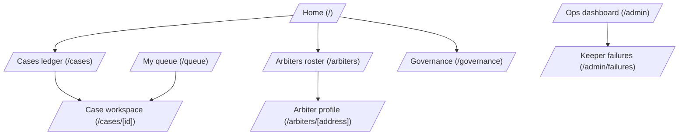

# Aegis — UX design spec

A design brief for the frontend. Aegis is an Eclipse-DAO-administered
arbitration court that resolves escrow disputes via VRF-sortitioned
arbiters. This document covers screens, flows, design language, and
cross-cutting UX invariants — particularly the **de novo blindness**
property that constrains what arbiters can see.

Status: **draft** — coupled to the arbitration redesign in
`docs/arbitration-redesign.md`. The new design replaces panels of
3–7 arbiters with a single original arbiter + 2-arbiter appeal
augmentation; the UI must reflect this shift.

## Design language

Aegis is a **court**, not a marketing site. The vibe is text-dense,
utilitarian, and monochrome — closer to GitHub Issues or a docket
viewer than a consumer dapp. The user is here to do administrative
work (file briefs, cast votes, review verdicts), not to be delighted
by motion design.

### Palette

- **Base**: zinc 50 / 950 (light / dark). System color-scheme aware.
- **Borders**: zinc 200 / 800. Subtle, never busy.
- **Surfaces**: white / zinc 950. Cards float on the base.
- **Text**: zinc 900 / 100 primary, zinc 500/400 muted, zinc 400/500
  even more muted (for hints, timestamps, asides).
- **Accent (action)**: zinc 900 / 100 inverted — the primary button
  is high-contrast, not colored. The system uses no brand color.
- **State colors** (used sparingly in badges and admin):
  - amber for warnings / "needs attention"
  - red for errors / overdue / slashed
  - emerald for resolved / paid
  - sky for in-progress / awaiting

The point of avoiding a brand color is that this is **infrastructure**.
A neutral palette signals seriousness; bright colors would feel
out of place in a courtroom context.

### Typography

- Single sans-serif throughout (system stack).
- `font-feature-settings: "ss01" on, "cv11" on` already configured —
  enables ligature + alt forms for cleaner numerals.
- Code / addresses / case IDs in `font-mono text-xs`. Always.
- Headlines: `text-3xl font-semibold tracking-tight` for h1,
  `font-medium` for h2.
- Body: 14-15px (`text-sm` and `text-base`). Long-form briefs at
  `text-base leading-7` so they're readable.

### Density and rhythm

- Maximum content width: `max-w-5xl` centered. Wider feels web-y.
- Section spacing: `space-y-8` between top-level sections,
  `space-y-4` within.
- Cards: `p-4`, rounded-lg, subtle shadow, 1px border. No drop
  shadows beyond the existing `shadow-sm`.
- Tables (cases ledger, arbiters list): zebra striping is fine but
  not required; row borders work.

### Component primitives (already in `styles/globals.css`)

- `.card` — bordered surface with shadow-sm.
- `.btn-primary` — high-contrast filled button.
- `.btn-secondary` — bordered, surface-colored button.
- `.input` — bordered text input, mono font for hashes.
- `.badge` — pill, used for case status, arbiter status.

Designer should treat these as the seed; expand the kit only when
truly needed (don't introduce a fifth button variant unless you can
explain the semantic difference).

## Information architecture

### Auth-gated routes

- **Public** (no wallet required): Home, Cases ledger, Arbiters
  roster, Governance proposal builder (read), Case workspace
  (party identities + briefs visible only post-resolution).
- **SIWE-required**: My queue, Case workspace party-side actions
  (file brief, request appeal), arbiter actions (commit, reveal,
  recuse), arbiter profile encryption setup.
- **Role-gated within auth**: Arbiter actions only render when the
  signed-in wallet is on the case's panel; admin pages may be
  unrestricted-read but the underlying RPC keys live elsewhere.

### Top nav

A single bar across the top with: wordmark · Cases · My queue ·
Arbiters · Governance · Ops (muted) · SIWE sign-in button on the
right. Already implemented; designer should treat it as canonical
and not invent additional global nav.

## User roles and contexts

Aegis has more user types than a typical dapp. The same wallet may
be in multiple roles across different cases. **Each screen needs to
render correctly for whichever role the viewer currently holds for
the resource they're looking at.**

### Visitor (no wallet, or signed-out)

- Reads the public ledger of cases.
- Sees post-resolution data (verdict, parties, fee distribution).
- **Cannot see** arbiter identities for in-flight cases (D13
  anonymity), in-flight briefs, or commit hashes that haven't been
  revealed.

### Party (plaintiff / defendant)

A party is one of `partyA` or `partyB` on a specific case. They've
already gone through Vaultra's escrow setup (or another integrated
escrow) and are now in dispute.

- Files briefs (encrypted off-chain to arbiters).
- Watches the case progress through states.
- Decides whether to appeal (D12 gate: only if they didn't fully win).
- Claims any verdict-weighted rebate (D1(c)).

A party knows full context of their own case. Their UI shows
everything: state, deadlines, original verdict (after reveal),
appeal status, etc.

### Arbiter

An arbiter is a registered, ELCP-staked wallet. They may be drawn
for a case via VRF (1 arbiter for original, or 1 of 2 for appeal).

**Critical UX requirement (de novo)**: an arbiter's UI must NOT
distinguish between original and appeal cases when they're drawn.
They see "a case to arbitrate" — same shape, same fields, same
flow. They commit + reveal a vote. They never see whether a prior
verdict exists for this case, who other arbiters are, or that
they're contributing to a median rather than rendering solo. See
the "Critical UX invariants" section below for the enforcement
checklist.

When an arbiter is NOT acting as an arbiter — e.g., they're
viewing the public ledger or their own profile — they see normal
public information.

### Governance member (DAO)

A member of the Eclipse DAO's multisig. They use the governance
calldata builder to compose policy / roster proposals that go to
the DAO timelock.

This is a power-user flow. Visual design can be denser and more
technical than the party / arbiter views.

### Admin / operator

Whoever runs the keeper / monitors the system. Reads the ops
dashboard for keeper liveness, VRF stuck cases, indexer cursor
lag, and the failure log. Read-only UI; remediation happens
out-of-band (top up VRF subscription, restart keeper, etc.).

### Same-wallet, multi-role example

Wallet `0xAlice` could simultaneously be:
- A party in case #42 (her dispute with Bob)
- An arbiter for case #71 (a different dispute she was drawn into)
- A DAO multisig signer (when wearing her governance hat)

The UI must contextualize correctly: when Alice opens case #71's
workspace, she sees the arbiter UX (de novo sanitized). When she
opens case #42's workspace, she sees the party UX. The route is
the same; the rendering branches on role detection.

## Screens

### Home (`/`)

Landing page. Already implemented; designer should refresh.

**Above the fold**:
- H1 "Aegis" + 2-line description: "Eclipse-DAO arbitration. Vetted,
  ELCP-staked arbiters resolve disputes for any escrow protocol that
  implements `IArbitrableEscrow`."
- No hero image, no marketing flourish. This is a court, not a SaaS.

**Below**:
- 2×2 grid of `.card` tiles, each linking to a top-level area:
  - **Cases ledger** — public list of opened, in-flight, and resolved cases
  - **Arbiters** — registered roster, ELCP stake, on-chain case counts
  - **Governance bridge** — calldata builder for DAO proposals
  - **Plug in your escrow** — static info card pointing at integration docs

**No personalization.** Even if signed in, the home page doesn't
default to "your queue." That would couple a public landing to a
wallet state in a confusing way. If a user wants their queue, they
click "My queue" in the nav.

**Footer**: GitHub link, security review, integration docs. Tiny,
muted, single line.

### Cases ledger (`/cases`)

The public docket. Lists all cases on the indexed Aegis instance.

**Header**:
- H1 "Cases"
- Filter chips below: All · In flight · Resolved · Defaulted (or
  similar). Count badges next to each.
- Optional: Search by caseId / party address.

**Table** (or feed of rows; a table works fine here):
- Columns: Case ID (mono, truncated) · Parties (mono, both addresses
  or ENS if available, truncated) · Amount (USDC formatted) · Status
  (badge) · Opened (relative time)
- Click row → case workspace.
- Status badge color: amber for in-flight, sky for committed but not
  resolved, emerald for resolved, red for defaulted/stalled.

**Pagination**: simple "load more" or numbered. The public ledger
will grow; don't try to render 10,000 rows at once.

**Empty state**: "No cases on this Aegis instance yet" + link to
the integration doc. Avoid stock illustrations; just text.

**Per-case privacy**: D13 soft anonymity — the public row should
NOT show assigned arbiter addresses for in-flight cases. After
resolution, arbiter addresses are visible (or governance-config
to remain hidden). Designer to confirm with PM whether even
post-resolution arbiter identity is suppressed.

### Case workspace (`/cases/[id]`)

The most important and complex screen. Renders dramatically
differently for the three viewer types: **public visitor**,
**party**, **arbiter (de novo)**.

#### Shared shell (all viewers)

- Breadcrumb: Cases · #abcdef… (truncated case ID)
- H1: "Case #abcdef…" with a copy-button next to the full ID.
- Subtitle: parties + amount + escrow source. E.g.,
  "Alice ↔ Bob · 1,000 USDC · Vaultra escrow".
- Status badge in the top right.

The shell is the same. The body splits:

#### Party view

The party knows everything. Render the full case context.

**Sections** (top to bottom, vertical stack):

1. **Status panel** — current state, deadline countdown(s), what
   action the user can take. E.g., during the appeal window, this
   panel surfaces a "Request appeal" button (gated by D12 — full
   winners can't appeal; gray it out with an inline explanation).

2. **Briefs** — both parties' briefs, side-by-side on desktop or
   stacked on mobile. Editable for the viewer's own brief while
   the case is in `Voting` (i.e., before the arbiter reveals);
   read-only after. Encrypted briefs render through
   `encrypted-brief-viewer.tsx` — a "decrypt" button if the viewer
   has a key registered, plain text view otherwise.

3. **Evidence panel** — file attachments, off-chain references.
   Existing component `evidence-panel.tsx` covers this.

4. **Verdict & timeline** — once the original arbiter reveals,
   show the verdict prominently (e.g., "Verdict: 60% to you, 40%
   to Bob"). Below it, a chronological timeline of state
   transitions: "Dispute opened → Arbiter drawn → Vote committed
   → Vote revealed → Appeal window: 3d 14h remaining". Use the
   existing `case-timeline.tsx`.

5. **Appeal action** (if appeal window open and viewer is eligible
   per D12). Existing component `appeal-button.tsx` — show the
   appeal fee in the escrow's fee token (e.g., "2.5% of disputed
   amount = 25 USDC"). Two-step UX: "Request appeal" button →
   confirmation modal showing the fee + an explanation that this
   triggers a fresh 2-arbiter panel.

6. **Fee distribution** (post-resolution) — collapsible card
   showing arbiter pay, party rebates per D1(c), claim button if
   the viewer has anything to claim.

#### Arbiter view (DE NOVO — critical)

The arbiter is here to do their job. They see exactly what the
original arbiter would see for any case, regardless of whether
they were drawn for the original or an appeal slot.

**Visible**:
- Briefs from both parties (encrypted; arbiter must have an
  encryption key registered to decrypt — see Arbiter profile)
- Evidence
- Their own commit/reveal status
- The deadline they need to act by (either commit deadline or
  reveal deadline, whichever is current)
- The disputed amount
- Their fee on resolution

**Not visible**:
- Whether this case is original or appeal phase
- Any prior verdict (the original arbiter's reveal, when they
  themselves are an appeal arbiter)
- The other appeal arbiter's identity or vote
- The case's full timeline / event history
- The state badge (or it shows a generic "Voting" with no phase
  distinction)

**Layout**:
- The same shell + status panel up top, but the status panel only
  surfaces "Submit your commit" or "Reveal your vote" with a
  countdown. No "this is an appeal" copy. No "the original
  arbiter ruled X, your role is to confirm or overturn."
- Briefs are just briefs. Same component as party view, but the
  arbiter sees both.
- Commit/reveal form is the existing `commit-reveal-form.tsx`,
  reworked to drop any "appeal" labels (D14 keeps the word
  "arbiter" everywhere; never "panelist" or "judge").
- Recuse button is available before they've committed. Wire it to
  the contract's `recuse(caseId)`.

**The hard part for the designer**: making sure the page
"feels normal" for an appeal arbiter. They should not get the
sense that anything is missing. Test by mocking up both an
original-phase and appeal-phase case for the same arbiter — the
two should be indistinguishable to them.

#### Public visitor view

Same shell. Body shows:
- Briefs only after resolution (D13 / privacy — until the case is
  closed, the briefs aren't public).
- Verdict, timeline, fee distribution post-resolution.
- During flight: just status + parties + amount. No briefs, no
  arbiter identities.

This is the "public docket" view that lets observers see what the
court has done historically without leaking in-flight details.
